# DCMS Project Flowchart And Data Flow Diagrams

This document summarizes the main workflow and data flow of the Disaster Casualty Management System, covering the web dashboard, mobile/PWA app, backend API, Supabase database, Supabase Auth, Supabase Storage, and offline sync behavior.

For one-file PDF export, open `PROJECT_FLOWCHART_AND_DFD_PRINT.html` in a browser, wait for all diagrams to render, then use Print > Save as PDF.

## 1. System Overview Flowchart

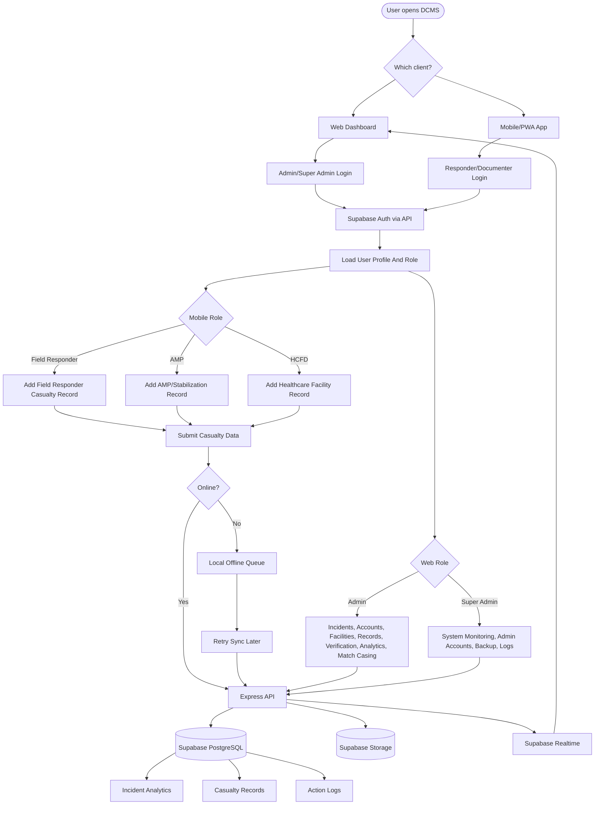

## 2. Web Dashboard Flowchart

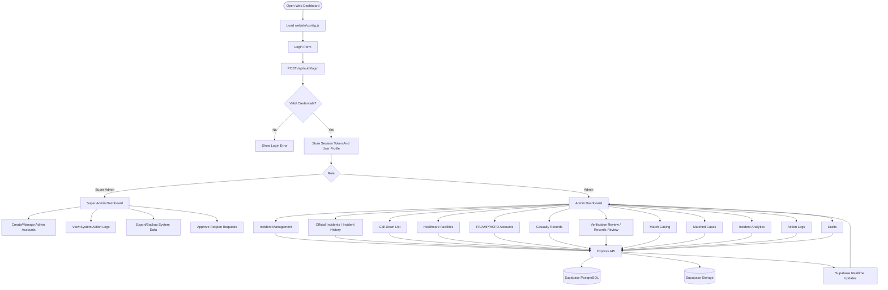

## 3. Mobile/PWA Flowchart

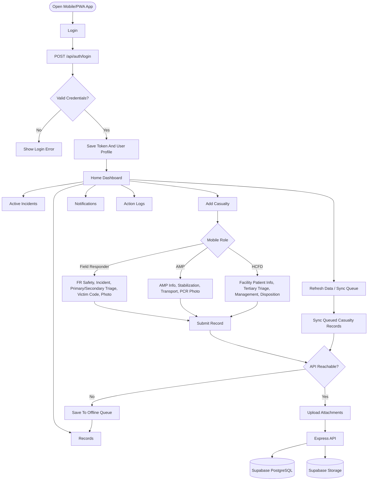

## 4. Context Diagram / DFD Level 0

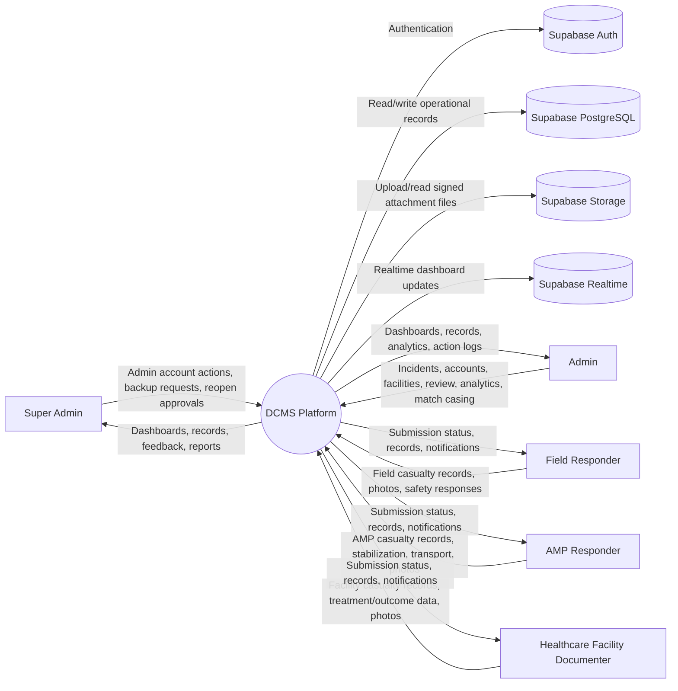

## 5. DFD Level 1 - Web Dashboard

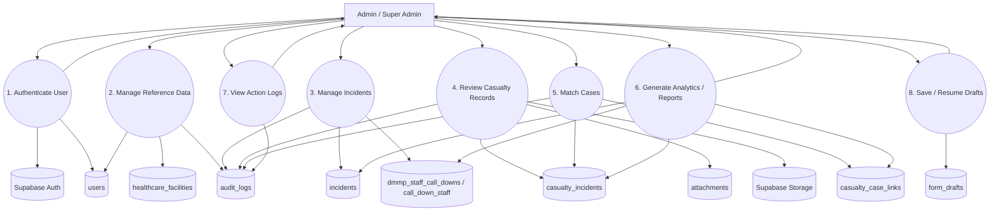

## 6. DFD Level 1 - Mobile/PWA App

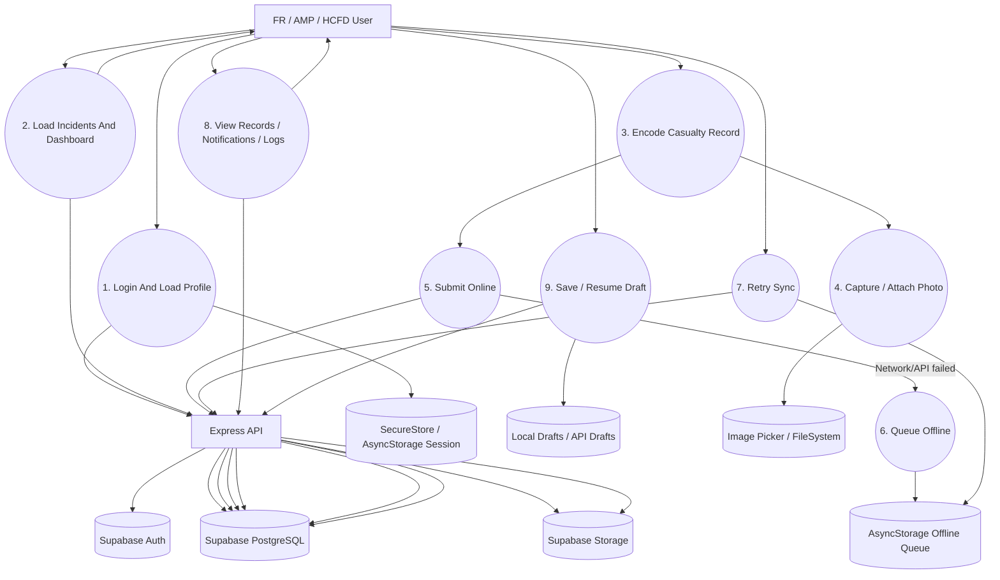

## 7. Database And Storage DFD

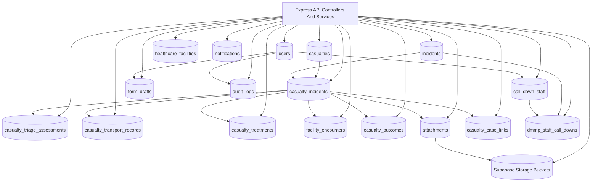

## 8. Casualty Submission And Verification Flow

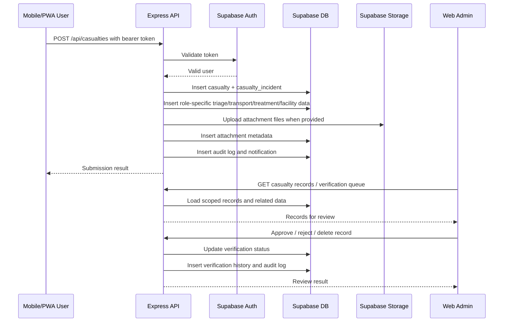

## 9. Match Casing Flow

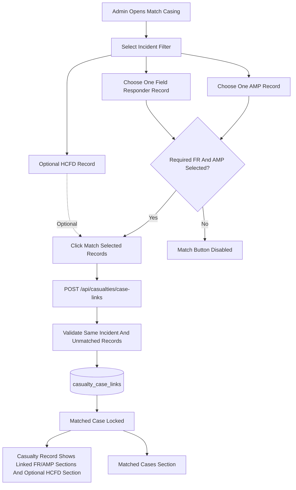

## 10. Offline Sync Flow

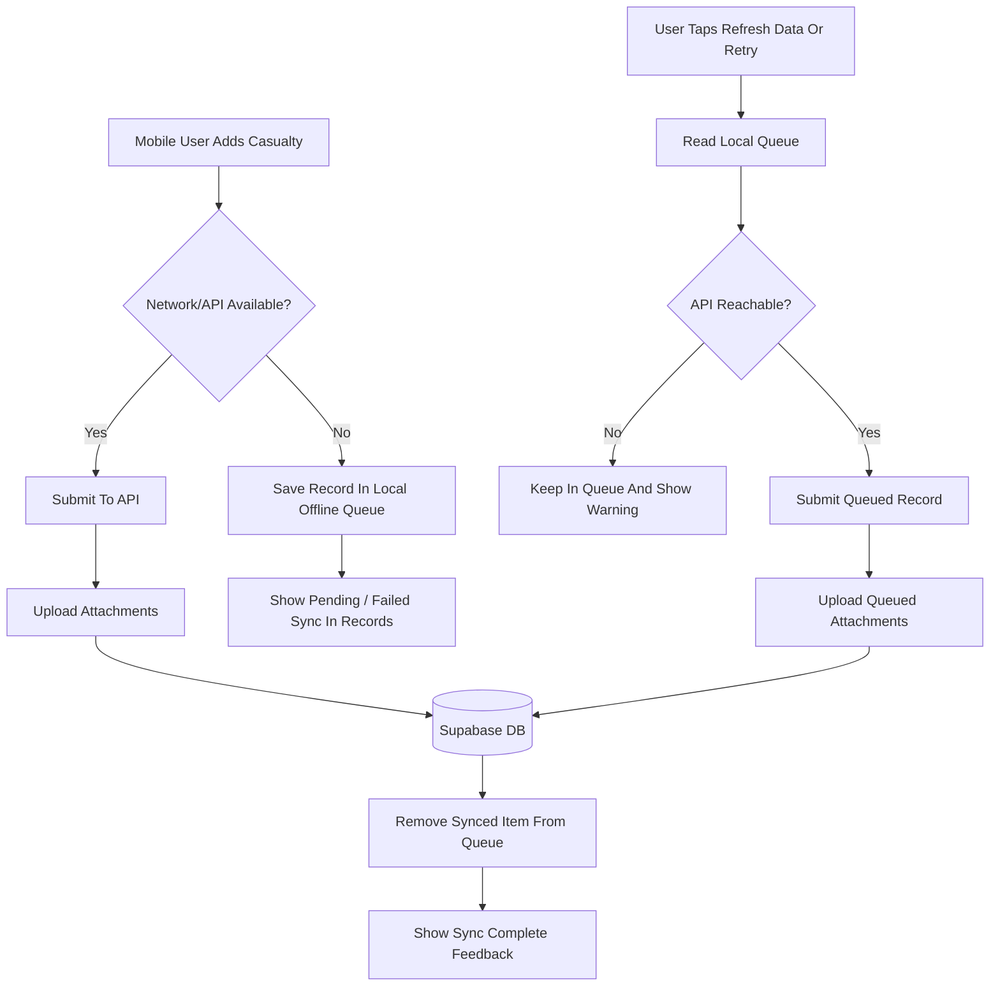

## 11. Main Data Stores

| Store | Purpose |
| --- | --- |
| `users` | User profile, role, assignment, admin scope, account metadata. |
| `incidents` | Official disaster incident records and status. |
| `casualties` | Person-level casualty identity/demographic information. |
| `casualty_incidents` | Incident-specific casualty record, status, severity, encoder, location, verification status. |
| `casualty_triage_assessments` | Primary, secondary, and tertiary triage assessment data. |
| `casualty_transport_records` | AMP/transport movement and receiving facility details. |
| `casualty_treatments` | Stabilization/treatment/PCR-related data. |
| `facility_encounters` | HCFD arrival, ED care, admission, management, ICU, and disposition data. |
| `casualty_outcomes` | Final outcome/death/disposition details. |
| `attachments` | Attachment metadata linked to casualty records. |
| Supabase Storage | Actual uploaded attachment files/photos. |
| `casualty_case_links` | Manual match casing links between required FR and AMP records, with optional HCFD records. |
| `healthcare_facilities` | Facility reference list. |
| `call_down_staff` | Reusable staff contact list, including staff without login accounts. |
| `dmmp_staff_call_downs` | Incident-specific call-down response, contacted, arrived, status, and arrival time. |
| `form_drafts` | Saved draft payloads for web/mobile add workflows. |
| `audit_logs` | Action logs across web/mobile activities. |
| `notifications` | Notifications for users/admin workflows. |

## 12. Deployment View

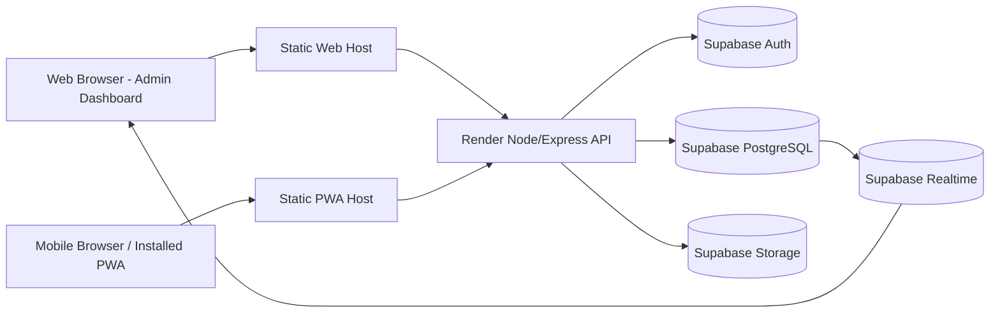

## 13. Notes For Submission

- The web dashboard and mobile/PWA app do not directly write to the database. They call the Express API.
- Supabase Auth handles authentication, but role and scope decisions are also enforced by the API.
- Supabase PostgreSQL stores structured operational data.
- Supabase Storage stores casualty attachments/photos.
- Supabase Realtime helps the web dashboard update when operational records change.
- Mobile/PWA supports offline queueing for casualty submissions and retries when the API becomes reachable again.
- Match Casing does not merge or delete records. It creates a link layer through `casualty_case_links`.
