# DCMS System Architecture And Database Schema

This document provides Mermaid-ready diagrams for the Disaster Casualty Management System architecture and database schema. It is intended for technical submission, documentation, and presentation materials.

For one-file PDF export, open `SYSTEM_ARCHITECTURE_AND_DATABASE_SCHEMA_PRINT.html` in a browser, wait for all diagrams to render, then use Print > Save as PDF.

The diagrams are based on the current project structure:

- `website/` - Web dashboard for admins and super admins.
- `mobile/` - Expo React Native / PWA app for Field Responders, SAR, and HCFD users.
- `api/` - Node/Express API.
- Supabase - Auth, PostgreSQL, Storage, and Realtime.

## 1. System Architecture Diagram

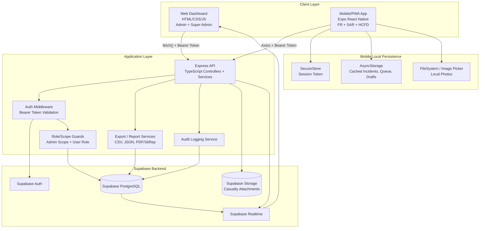

## 2. Deployment Architecture

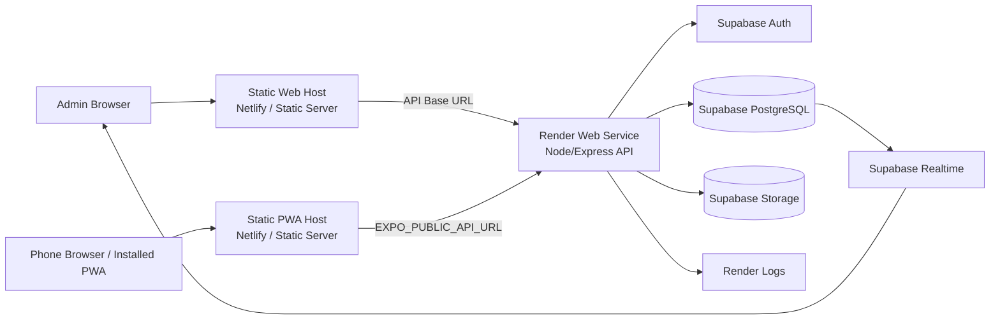

## 3. Backend API Module Architecture

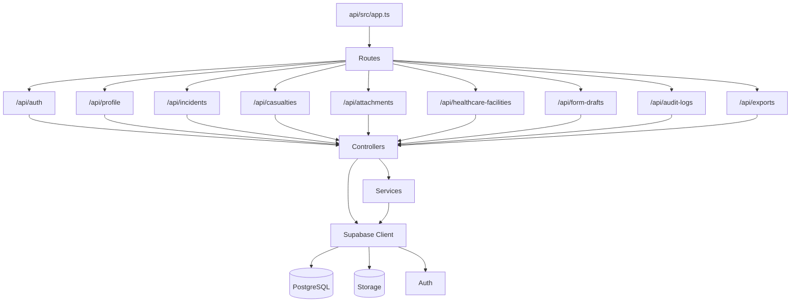

## 4. Client Architecture

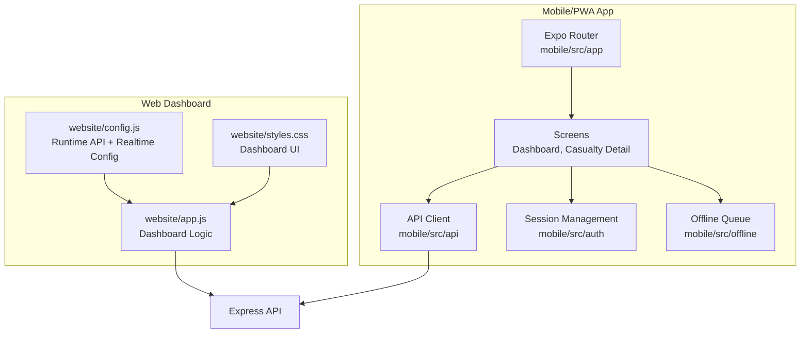

## 5. Database Schema Overview

```mermaid
erDiagram
  USERS ||--o{ INCIDENTS : creates
  USERS ||--o{ CASUALTY_INCIDENTS : encodes
  USERS ||--o{ AUDIT_LOGS : performs
  USERS ||--o{ FORM_DRAFTS : owns
  USERS ||--o{ NOTIFICATIONS : receives

  INCIDENTS ||--o{ CASUALTY_INCIDENTS : contains
  CASUALTIES ||--o{ CASUALTY_INCIDENTS : appears_in
  CASUALTY_INCIDENTS ||--o{ CASUALTY_TRIAGE_ASSESSMENTS : has
  CASUALTY_INCIDENTS ||--o{ CASUALTY_TRANSPORT_RECORDS : has
  CASUALTY_INCIDENTS ||--o{ CASUALTY_TREATMENTS : has
  CASUALTY_INCIDENTS ||--o{ FACILITY_ENCOUNTERS : has
  CASUALTY_INCIDENTS ||--o{ CASUALTY_OUTCOMES : has
  CASUALTY_INCIDENTS ||--o{ ATTACHMENTS : has
  CASUALTY_INCIDENTS ||--o{ CASUALTY_STATUS_HISTORY : has
  CASUALTY_INCIDENTS ||--o{ CASUALTY_VERIFICATION_HISTORY : has

  INCIDENTS ||--o{ CASUALTY_CASE_LINKS : groups
  CASUALTY_INCIDENTS ||--o{ CASUALTY_CASE_LINKS : linked_record

  HEALTHCARE_FACILITIES ||--o{ FACILITY_ENCOUNTERS : receives
  HEALTHCARE_FACILITIES ||--o{ CASUALTY_TRANSPORT_RECORDS : destination
  HEALTHCARE_FACILITIES ||--o{ FACILITY_RESOURCE_SNAPSHOTS : reports

  INCIDENTS ||--o{ INCIDENT_RESPONSE_TIMELINES : has
  INCIDENTS ||--o{ DMMP_STAFF_CALL_DOWNS : has
  INCIDENTS ||--o{ MEDICAL_COORDINATION_ASSESSMENTS : has
  INCIDENTS ||--o{ RESPONDER_SAFETY_RESPONSES : has
  INCIDENTS ||--o{ SITREPS : has
```

## 6. Core Identity And Incident Tables

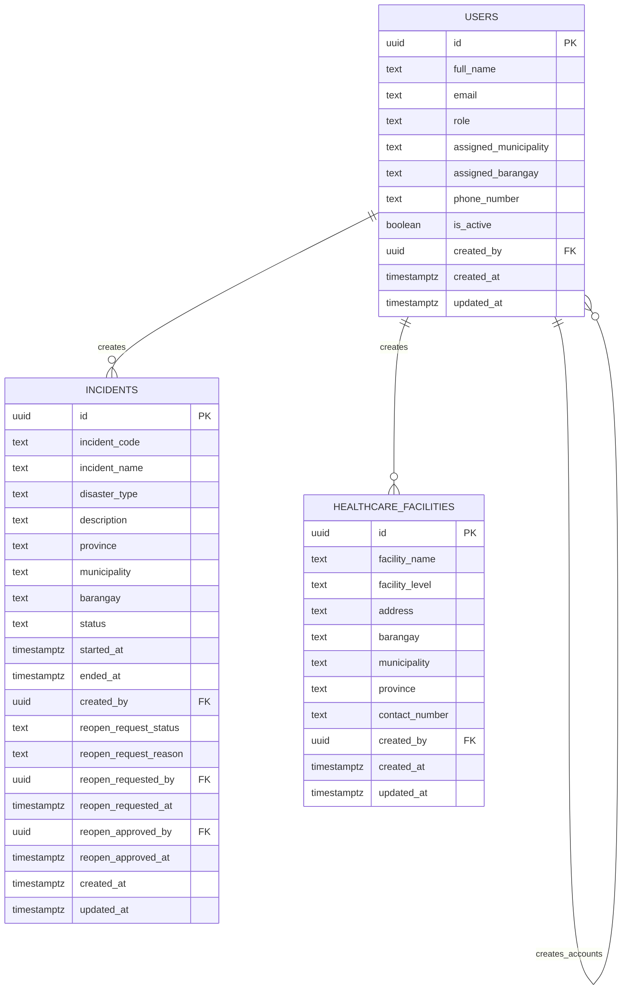

## 7. Casualty Record Schema

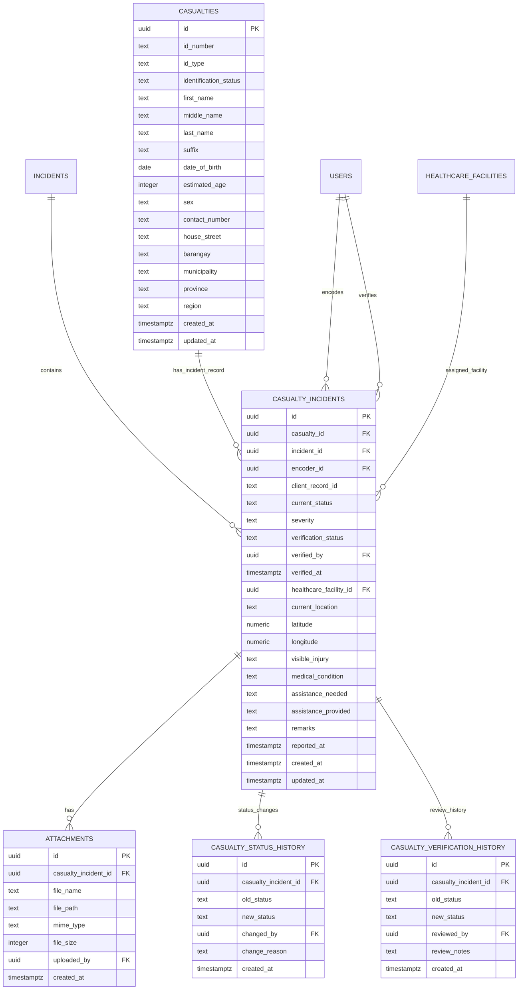

## 8. Triage, Transport, Treatment, And HCFD Schema

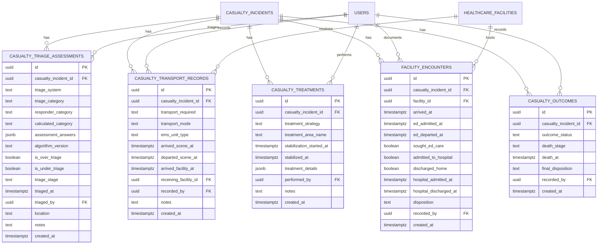

## 9. Match Casing Schema

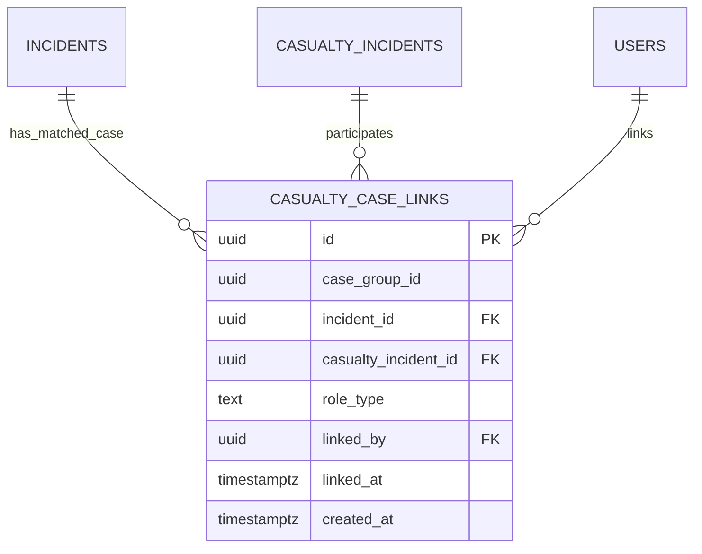

## 10. Incident Operations Schema

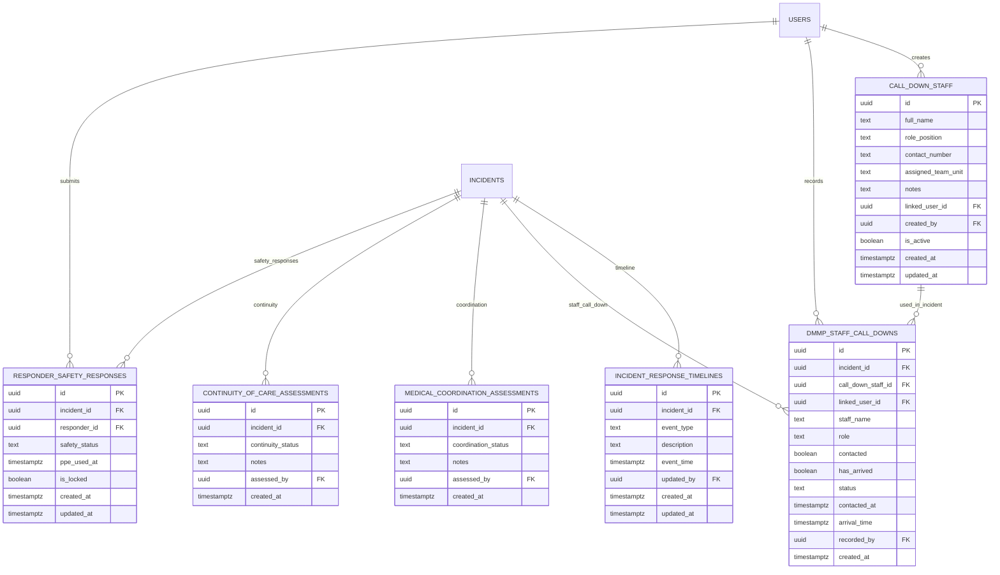

## 11. Reporting, Logs, Notifications, And Drafts Schema

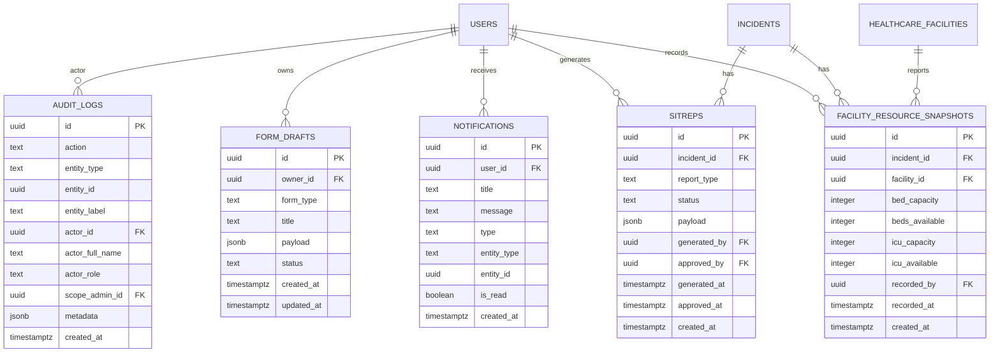

## 12. Role-Based Access Architecture

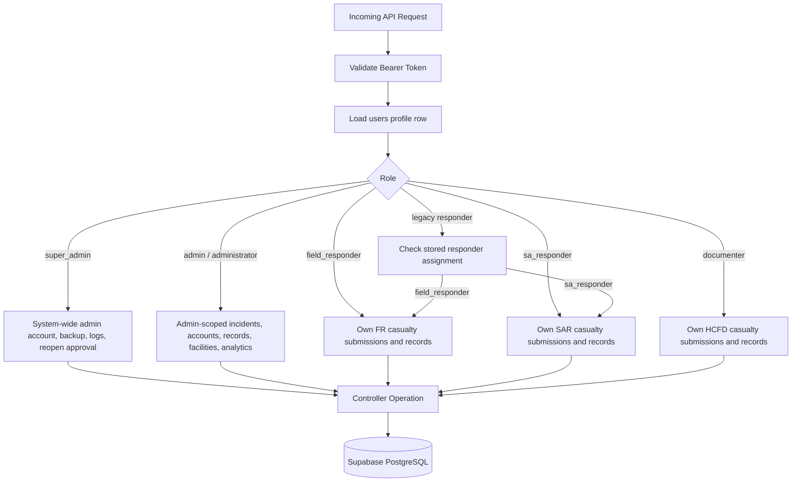

## 13. Offline Data Architecture

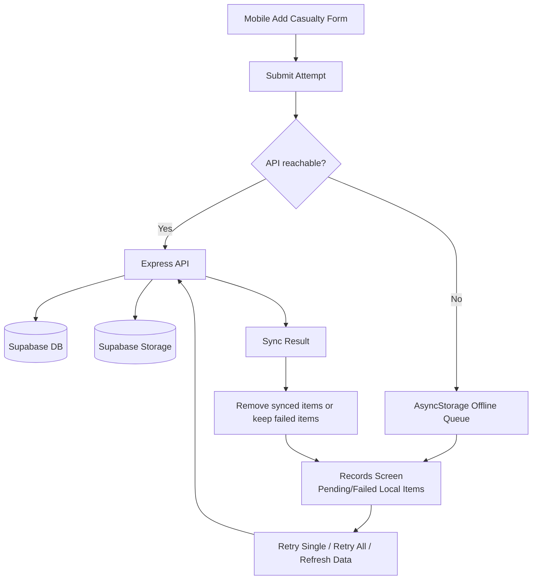

## 14. Database Notes

- `casualties` stores person-level identity data.
- `casualty_incidents` stores incident-specific casualty records, including status, severity, encoder, location, and verification state.
- FR, SAR, and HCFD records remain separate records after role separation.
- `casualty_case_links` connects separate FR, SAR, and HCFD records into one matched case without merging or deleting the original records.
- `attachments` stores metadata, while Supabase Storage stores the actual files.
- `audit_logs` stores cross-device actions for traceability.
- `form_drafts` stores saved draft payloads.
- `call_down_staff` stores reusable staff contacts, including people who do not have login accounts.
- `dmmp_staff_call_downs` stores incident-specific call-down responses.
- Some SQL migrations add columns incrementally, so the diagrams show the practical/current logical schema instead of every historical migration step.
