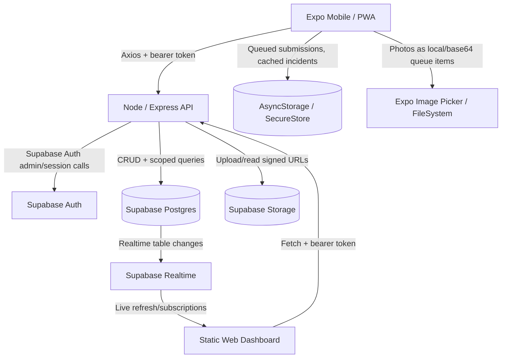
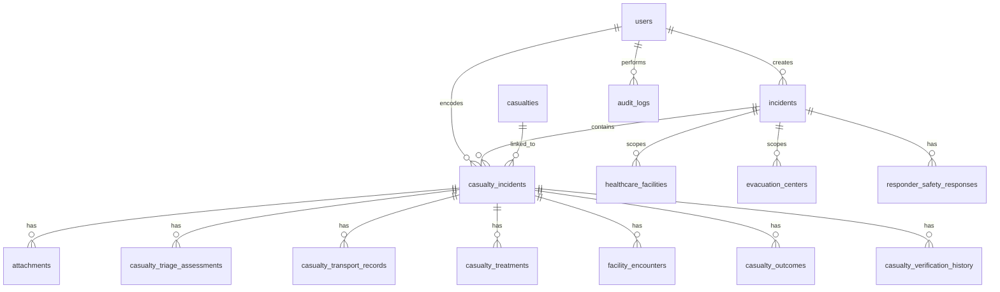
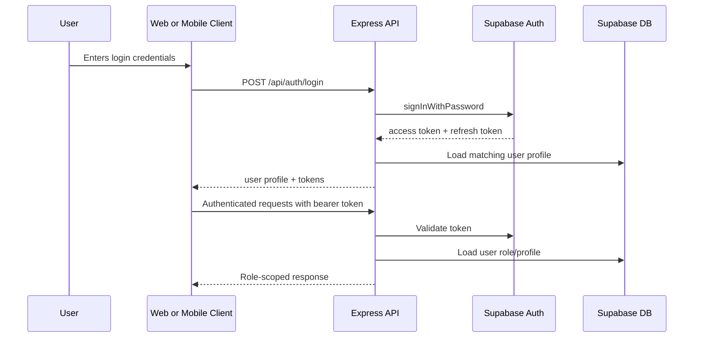
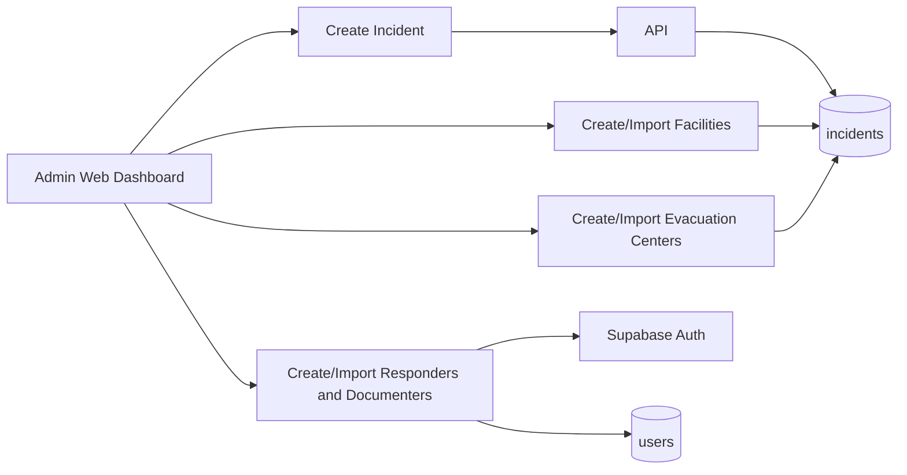
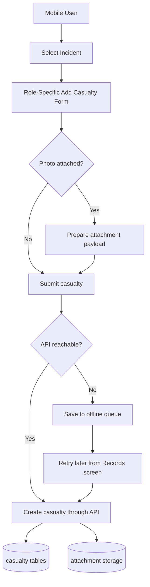
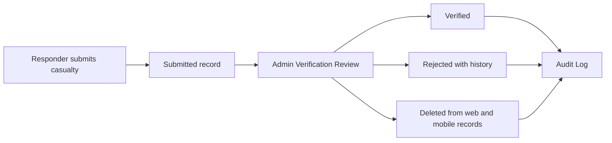
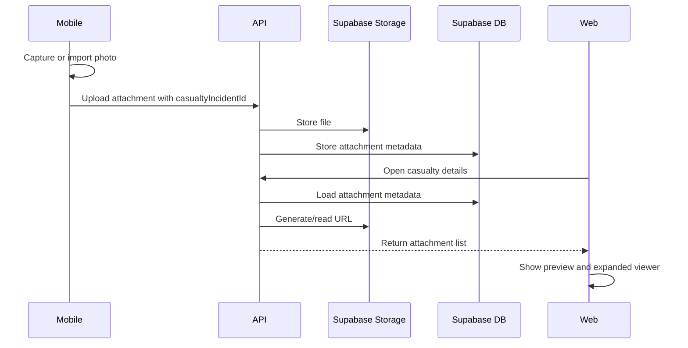

# DCMS Current System Architecture

Current status snapshot for the Disaster Casualty Management System covering the web dashboard, mobile/PWA app, backend API, Supabase data layer, realtime behavior, offline behavior, exports, attachments, audit logs, and known architecture risks.

## 1. System Overview

DCMS is a role-based casualty and incident management platform. It has two main client applications:

- **Web dashboard** for super admins and admins.
- **Mobile/PWA app** for responders, SAR/stabilization responders, healthcare facility documenters, and mobile-side reviewers.

Both clients connect to the same Express API. The API handles authentication, role scoping, casualty records, incidents, attachments, audit logs, exports, analytics, notifications, and operational reset/delete actions. Supabase provides authentication, PostgreSQL database storage, object storage for attachments, and realtime database events used by the web dashboard.

## 2. User Roles

- **Super Admin**
  - Uses the web dashboard.
  - Creates and manages admin-level accounts.
  - Sees system-level records, audit logs, exports, and reset tools.

- **Admin / Administrator / Encoder**
  - Uses the web dashboard.
  - Creates incidents, responder/documenter accounts, healthcare facilities, and evacuation centers.
  - Reviews casualty records and manages incident operations.
  - Sees scoped audit logs and records connected to their admin unit.

- **Responder / Field Responder**
  - Uses the mobile/PWA app.
  - Adds field casualty information and primary triage-related data.
  - Can queue records offline after incident data has been cached.

- **SAR / Stabilization Area Responder**
  - Uses the mobile/PWA app.
  - Adds stabilization, transport, and scene-side casualty details.
  - Can attach casualty photos.

- **Healthcare Facility Documenter**
  - Uses the mobile/PWA app.
  - Adds facility-side casualty records, triage, treatment, outcome, resource, and continuity details.

## 3. Application Components

### Web Dashboard

Location:

- `website/index.html`
- `website/app.js`
- `website/styles.css`

Technology:

- Static HTML, CSS, and JavaScript.
- Fetch API for backend communication.
- Supabase JS client for realtime refresh behavior.
- Hosted as a static web app, currently compatible with Netlify-style deployment.

Current dashboard capabilities:

- Login and session persistence.
- Super admin summary dashboard.
- Admin summary dashboard.
- Account creation, edit, deactivate/delete access, and Excel/CSV-style bulk upload preview.
- Incident creation and incident management.
- Incident analytics with timeline visuals, text metrics, pie charts, and percentage-over-time charts.
- Casualty records with sorting, filters, attachment previews, and expanded attachment viewing.
- Verification review with approve, reject, and delete actions.
- Healthcare facility and evacuation center creation/import/export.
- Audit logs/action logs.
- Data export and backup actions.
- Profile modal with account edit, password change, and scoped reset controls.
- In-app confirmation modals and standardized feedback messages.
- Responsive mobile browser layout for presentation fallback.

### Mobile / PWA App

Location:

- `mobile/src/app/`
- `mobile/src/api/`
- `mobile/src/auth/`
- `mobile/src/offline/`

Technology:

- Expo.
- React Native.
- Expo Router.
- TypeScript.
- Axios.
- AsyncStorage and SecureStore.
- Expo Image Picker and FileSystem.
- React Native Web for PWA/web export.

Current mobile capabilities:

- Login and token refresh.
- Role-aware home/dashboard.
- Add Casualty wizard.
- Role-specific casualty entry fields.
- Incident selection.
- Offline cached incident list after first successful online load.
- Offline casualty submission queue.
- Attachment capture/import for casualty records.
- Records screen with synced and queued casualties.
- Queue status display with pending/failed states.
- Retry single queued record and retry-all queued records.
- Notifications.
- Mobile verification/review surfaces where supported.

### Backend API

Location:

- `api/src/app.ts`
- `api/src/routes/`
- `api/src/controllers/`
- `api/src/services/`

Technology:

- Node.js.
- Express 5.
- TypeScript.
- Supabase JavaScript client.
- CORS.
- dotenv.

Main API route groups:

- `/api/auth`
  - Login, token refresh, account creation, account edit, password update, account deactivation/delete behavior, bulk account import, reset preview, and operational data reset.

- `/api/profile`
  - Current user profile and assigned context.

- `/api/incidents`
  - Incident list, create/update, analytics, SitRep, incident export, incident close, and incident operational modules.

- `/api/casualties`
  - Casualty creation, listing, detail view, update, verification status, deletion, status history, triage history, transport history, and review workflows.

- `/api/casualty-incidents`
  - Triage assessment and casualty-incident level operations.

- `/api/attachments`
  - Attachment upload, metadata, storage access, and signed URL delivery.

- `/api/healthcare-facilities`
  - Facility reference creation, listing, import, and export.

- `/api/evacuation-centers`
  - Evacuation center reference creation, listing, import, and export.

- `/api/dashboard`
  - Dashboard counts and recent activity.

- `/api/notifications`
  - User notifications.

- `/api/audit-logs`
  - Role-scoped audit log retrieval.

- `/api/exports`
  - CSV/JSON exports for responders/documenters, healthcare facilities, evacuation centers, incident packages, casualty records, and system backup.

## 4. Data Layer

Supabase is the main persistence layer.

Important tables currently used by the system:

- `users`
- `incidents`
- `casualties`
- `casualty_incidents`
- `attachments`
- `casualty_triage_assessments`
- `casualty_transport_records`
- `casualty_treatments`
- `facility_encounters`
- `casualty_outcomes`
- `casualty_status_history`
- `casualty_verification_history`
- `healthcare_facilities`
- `evacuation_centers`
- `sitreps`
- `incident_response_timelines`
- `dmmp_staff_call_downs`
- `medical_coordination_assessments`
- `responder_safety_reports`
- `responder_safety_responses`
- `continuity_of_care_assessments`
- `facility_resource_snapshots`
- `notifications`
- `audit_logs`

Supabase Storage is used for casualty attachments. The API stores attachment metadata in the database and returns viewable URLs to the web and mobile clients.

## 5. Authentication And Authorization

Authorization is enforced by:

- API middleware that validates bearer tokens.
- API role guards such as `requireRole(...)`.
- Controller-level ownership and admin-scope checks.
- Dashboard-side role-aware navigation and view rendering.

Known current risk:

- Some privacy and visibility behavior is still partly enforced by frontend filtering. Backend role privacy should continue being tightened so every API response is scoped by role and ownership before data leaves the server.

## 6. Core Workflows

### Incident Setup

### Casualty Submission

### Verification Review

### Incident Analytics

Incident Analytics reads operational records for a selected incident and calculates:

- Timeline events.
- Incident onset to hospital arrival durations.
- Length-of-stay duration summaries.
- Primary and secondary triage category counts.
- Stabilization strategy counts.
- Responder safety counts.
- Cumulative percentage charts by time after DMMP activation.
- Healthcare facility arrival and ED-care metrics.

## 7. Realtime Update Model

The web dashboard uses a mixed realtime strategy:

- Supabase Realtime subscriptions are initialized from `website/app.js`.
- Audit logs also have a live refresh timer fallback.
- Dashboard views re-render after local state is refreshed.
- Manual refresh buttons still exist where useful, especially for analytics-heavy views.

Realtime-sensitive data includes:

- Casualty records.
- Verification review records.
- Incidents.
- Audit logs/action logs.
- Dashboard metrics.
- Incident analytics source data.

Operational note:

- Supabase Realtime must be enabled for the tables that should trigger live updates. If a table is not included in the realtime publication, the web dashboard may still require manual refresh or timer-based refresh.

## 8. Mobile Offline And Retry Architecture

Mobile offline support is currently implemented with AsyncStorage.

Key behavior:

- Incident options are cached after a successful online load.
- Offline users can select from the last saved incident list.
- Failed network submissions are stored in a local queue.
- Queue items include payload, attachments, status, attempts, and last error.
- Records screen shows pending/failed queued records.
- Users can retry one queued record or retry all queued records.

Offline queue storage includes:

- `payload`
- `incidentId`
- `offlineIncidentName`
- `attachments`
- `status`
- `attempts`
- `lastError`
- `syncedCasualtyIncidentId`

Known current limitations:

- First-time offline use still requires the device to have previously loaded incident data online.
- Large image attachments are stored in the local queue as base64 data, which can increase storage pressure.
- Real-device airplane mode and weak-connection tests should remain part of QA before presentation or deployment.

## 9. Attachments

Attachment flow:

The web dashboard and mobile records can display uploaded attachments. Web users can open attachments in a larger viewer for verification.

## 10. Audit Logs

Audit logs are stored in `audit_logs`.

Audited actions include:

- Account creation, edit, deactivation/delete access.
- Casualty creation, approval, rejection, deletion, and resubmission-related actions.
- Incident creation, edit, close, and reset actions.
- Healthcare facility and evacuation center creation/import.
- Bulk import results.
- Operational reset actions.

Visibility rules:

- Admins see actions for their account scope, including responders/documenters created under them.
- Super admins see admin-level audit activity.
- Responders and documenters do not directly use the audit log UI, but their casualty submission activity can appear in the admin's scoped logs.

## 11. Export And Backup Architecture

Exports are served through API endpoints instead of frontend-only downloads.

Supported export areas:

- Casualty records per incident.
- Responders/documenters.
- Healthcare facilities.
- Evacuation centers.
- Full incident package.
- Attachment references.
- Super admin system backup.

Export permissions are role-scoped by the API. Super admin system backup is restricted to super admins.

## 12. Deployment Shape

Current deployment model:

- **API:** Node/Express service, suitable for Render deployment.
- **Web dashboard:** Static website, suitable for Netlify deployment.
- **Mobile/PWA:** Expo app with web export using `npx expo export -p web --clear`.
- **Database/Auth/Storage/Realtime:** Supabase project.

Environment variables:

- `mobile/.env`
  - `EXPO_PUBLIC_API_URL`
- `api/.env`
  - Supabase URL/key configuration and API runtime settings.
- `website/app.js`
  - Contains local and production API base URL handling.

## 13. Current Strengths

- Clear split between mobile data capture and web command/admin review.
- Role-aware workflows for responders, SAR/stabilization, HCFD/documenters, admins, and super admins.
- Incident Analytics now centralizes timeline, casualty, triage, facility, responder safety, and resource metrics.
- Web dashboard has destructive-action confirmation modals and reset previews.
- Audit logs provide traceability for major admin and operational actions.
- Data export and system backup support has been added.
- Mobile offline queue supports failed casualty submissions and retry behavior.
- Attachment capture/import now works on mobile and is visible from the web dashboard.

## 14. Architecture Risks And Needed Improvements

These are the most important architecture improvements still worth prioritizing:

- **Backend role privacy:** enforce role and ownership scoping in every API response, not only in frontend display logic.
- **Regression tests:** add tests for auth, casualty creation, verification, deletion, analytics, exports, reset, and offline sync.
- **Shared field schema:** reduce duplicate role-based field logic between mobile and web by centralizing labels, field groups, and display rules.
- **Realtime reliability:** confirm all required Supabase tables are in realtime publication and keep polling fallbacks for critical views.
- **Offline storage pressure:** optimize attachment queue storage and test large-photo workflows on real devices.
- **API/service refactor:** split very large controllers and dashboard scripts into smaller service/view modules.
- **Presentation QA:** maintain a repeatable QA checklist for mobile browser, desktop dashboard, offline mode, attachments, realtime updates, exports, reset, and audit logs.

## 15. Key Source Files

- Web dashboard:
  - `website/app.js`
  - `website/styles.css`
  - `website/index.html`

- Mobile/PWA:
  - `mobile/src/api/client.ts`
  - `mobile/src/app/(tabs)/add-casualty.tsx`
  - `mobile/src/app/(tabs)/records.tsx`
  - `mobile/src/offline/casualtyQueue.ts`
  - `mobile/src/auth/session.ts`

- Backend API:
  - `api/src/app.ts`
  - `api/src/middleware/auth.ts`
  - `api/src/controllers/`
  - `api/src/routes/`
  - `api/src/services/audit-log.service.ts`

- Project documentation:
  - `ARCHITECTURE_COMPONENTS.md`
  - `IMPROVEMENT_CHECKLIST.md`
  - `BUGS_AND_SOLUTIONS.md`
