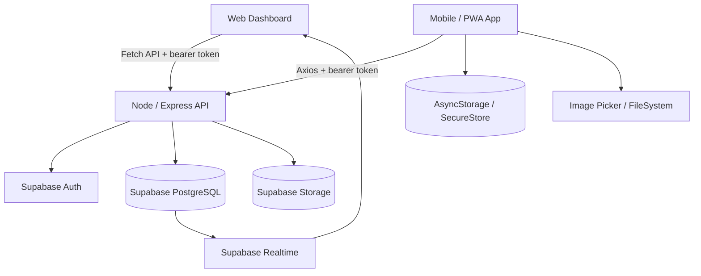
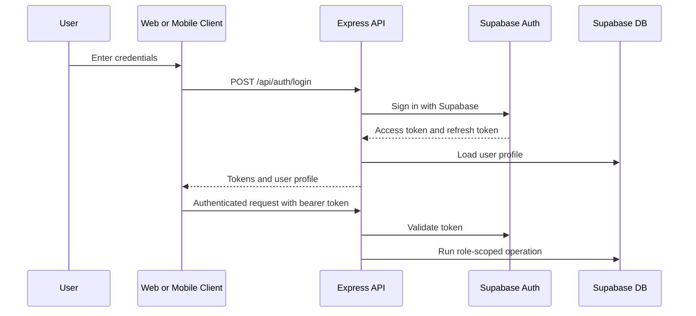
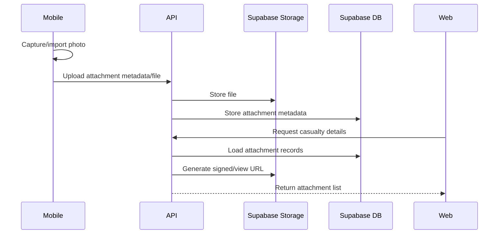

# Disaster Casualty Management System Technical Documentation

Progress submission version for the current Disaster Casualty Management System implementation.

## 1. Project Overview

The Disaster Casualty Management System, or DCMS, is a role-based casualty and incident management platform for disaster response operations. It provides:

- A web dashboard for super admins and admins.
- A mobile/PWA app for Field Responders, Advanced Medical Responders (AMP; previously SAR/Stabilization Area Responders), and Healthcare Facility Documenters.
- A Node/Express API that connects both clients to Supabase Auth, PostgreSQL, Storage, and Realtime.
- Role-scoped records, incident analytics, audit logs, data export, attachment handling, offline mobile queuing, and manual case matching.

The current system is a functional prototype/progress build intended for alpha testing, presentation, and further ISO/IEC 25010 quality evaluation.

## 2. High-Level Architecture



## 3. Main Components

### 3.1 Web Dashboard

Location:

- `website/index.html`
- `website/app.js`
- `website/styles.css`

Technology:

- Static HTML, CSS, and JavaScript.
- Fetch API for backend requests.
- Supabase Realtime subscription support.
- Can be hosted as a static website.

Current dashboard capabilities:

- Admin and super admin login.
- Session persistence.
- Admin dashboard summary.
- Super admin system summary.
- Admin account management.
- Separated account roles for Field Responder, AMP, and HCFD.
- Bulk upload preview for accounts and reference data.
- Healthcare facility management.
- Web Drafts folder for unfinished incident and healthcare facility forms.
- Web account creation drafts without temporary-password storage.
- Incident creation and incident history.
- Casualty records view.
- Casualty attachment preview and expanded viewer.
- Verification review with approve, reject, and delete workflows.
- Match Casing for connecting required FR and AMP records into one locked case, with HCFD optional.
- Matched Cases review section.
- Incident analytics.
- Audit/action logs.
- Data export and backup actions.
- Profile modal with account details, password update, and reset tools.
- Styled in-app confirmation and feedback messages.
- Responsive fallback layout for mobile browser viewing.

### 3.2 Mobile / PWA App

Location:

- `mobile/src/app/`
- `mobile/src/api/`
- `mobile/src/auth/`
- `mobile/src/offline/`

Technology:

- Expo.
- React Native.
- Expo Router.
- TypeScript.
- Axios.
- AsyncStorage and SecureStore.
- Expo Image Picker and FileSystem.
- React Native Web for PWA export.

Current mobile capabilities:

- Login and token-based session handling.
- Role-aware home/dashboard.
- Add Casualty wizard.
- Role-specific casualty entry:
  - Field Responder.
  - AMP/Advanced Medical Responder.
  - Healthcare Facility Documenter.
- Incident selection.
- Cached incident support for offline use after incident data has been loaded.
- Offline casualty submission queue.
- Pending and failed sync states.
- Retry single queued record.
- Retry all queued records.
- Attachment capture/import for casualty records.
- Local Drafts tab for unfinished casualty forms.
- Records screen for synced and locally queued records.
- Notifications and profile-related workflows.

### 3.3 Backend API

Location:

- `api/src/app.ts`
- `api/src/server.ts`
- `api/src/routes/`
- `api/src/controllers/`
- `api/src/services/`

Technology:

- Node.js.
- Express 5.
- TypeScript.
- Supabase JavaScript client.
- CORS.
- dotenv.

Main package scripts:

```powershell
cd api
npm.cmd run dev
npm.cmd run build
npm.cmd start
npm.cmd run typecheck
```

Important route groups:

- `/api/auth`
  - Login.
  - Token/account workflows.
  - Account creation and account management.
  - Bulk account import.
  - Reset preview and data reset.

- `/api/profile`
  - Current authenticated user profile and assigned context.

- `/api/incidents`
  - Incident list, creation, history, analytics, SitRep, and incident operational modules.

- `/api/casualties`
  - Casualty creation, listing, detail retrieval, verification workflows, deletion, status history, triage history, transport history, case links, and review workflows.

- `/api/casualty-incidents`
  - Triage assessment and casualty-incident operations.

- `/api/attachments`
  - Attachment upload, metadata, and signed URL access.

- `/api/healthcare-facilities`
  - Healthcare facility creation, listing, import, and export.

- `/api/audit-logs`
  - Role-scoped audit log retrieval.

- `/api/drafts`
  - Authenticated form draft create, list, update, and delete operations for web dashboard forms.

- `/api/exports`
  - CSV/JSON export endpoints for operational data and backup.

## 4. User Roles

### Super Admin

Primary client: Web dashboard.

Capabilities:

- Create and manage admin-level accounts.
- View system-wide summaries.
- View system-level exports and backup tools.
- View super admin scoped audit logs.
- Perform system-wide reset operations that keep accounts but clear operational data.

### Admin / Administrator / Encoder

Primary client: Web dashboard.

Capabilities:

- Create and manage Field Responder, AMP, and HCFD accounts.
- Create and manage official incidents.
- Manage healthcare facility references.
- Review casualty records.
- Verify, reject, or delete casualty records.
- Match required FR and AMP records into locked matched cases, with HCFD optional.
- View incident analytics.
- Export scoped operational data.
- View audit logs for the admin unit and created users.
- Perform admin-scoped reset operations that keep accounts.

### Field Responder

Primary client: Mobile/PWA app.

Capabilities:

- Create Field Responder casualty records.
- Record primary triage and field-side casualty details.
- Attach casualty photos.
- Queue casualty submissions while offline.
- Retry failed submissions.
- View own role-scoped records.

### AMP / Advanced Medical Responder

Primary client: Mobile/PWA app.

Capabilities:

- Create AMP/Stabilization casualty records.
- Record stabilization, transport, and scene-side details.
- Attach casualty photos.
- Queue casualty submissions while offline.
- Retry failed submissions.
- View own role-scoped records.

### Healthcare Facility Documenter

Primary client: Mobile/PWA app.

Capabilities:

- Create healthcare facility casualty records.
- Record facility-side triage, treatment, outcome, and resource details.
- Attach casualty photos.
- Queue casualty submissions while offline.
- Retry failed submissions.
- View own role-scoped records.

### Legacy Roles

Legacy `responder` and `medical_personnel` roles remain readable for existing records and accounts. They are preserved to avoid breaking old data. New accounts should use `field_responder`, `sa_responder`, or `documenter`.

## 5. Database And Storage

Persistence is handled through Supabase:

- Supabase Auth for login and account authentication.
- Supabase PostgreSQL for relational data.
- Supabase Storage for casualty attachments.
- Supabase Realtime for dashboard refresh behavior.

Important tables currently used:

- `users`
- `incidents`
- `casualties`
- `casualty_incidents`
- `casualty_case_links`
- `attachments`
- `casualty_triage_assessments`
- `casualty_transport_records`
- `casualty_treatments`
- `facility_encounters`
- `casualty_outcomes`
- `casualty_status_history`
- `casualty_verification_history`
- `healthcare_facilities`
- `sitreps`
- `incident_response_timelines`
- `dmmp_staff_call_downs`
- `medical_coordination_assessments`
- `responder_safety_reports`
- `responder_safety_responses`
- `continuity_of_care_assessments`
- `facility_resource_snapshots`
- `notifications`
- `audit_logs`
- `form_drafts`

Important migration/support SQL files:

- `api/sql/add-audit-logs.sql`
- `api/sql/add-separated-responder-roles.sql`
- `api/sql/add-primary-triage-systems.sql`
- `api/sql/add-casualty-case-links.sql`
- `api/sql/add-form-drafts.sql`

## 6. Authentication And Authorization

Authentication flow:



Authorization is enforced by:

- Bearer token validation middleware.
- Role guards such as `requireRole(...)`.
- Controller-level role and ownership checks.
- Admin-unit scoping for accounts, casualties, and audit logs.
- Frontend role-aware navigation and rendering.

## 7. Main Workflows

### 7.1 Account Creation

Admins create operational accounts from the web dashboard.

Supported new account roles:

- Field Responder.
- AMP Responder.
- Healthcare Facility Documenter.

The web dashboard also supports bulk import with preview and row validation. Existing legacy responder accounts remain editable.

### 7.2 Incident Setup

Admins create official incidents from the web dashboard. Incident records provide the operational context for mobile casualty submissions, analytics, review, exports, and matched cases.

### 7.3 Casualty Submission

Mobile users create casualty records through the Add Casualty wizard.

Basic flow:

1. User logs in.
2. User selects an incident.
3. The app shows role-specific casualty fields.
4. User fills required information.
5. User may capture or import casualty photos.
6. If online, the record is submitted to the API.
7. If offline or API is unreachable, the record is saved in the local queue.
8. The user can retry queued records later.

### 7.4 Verification Review

Admins review submitted casualty records in the web dashboard.

Supported actions:

- View record details.
- View attachments.
- Approve/verify.
- Reject with review history.
- Delete a record with confirmation.

### 7.5 Match Casing

Match Casing links separate role records for the same real-world casualty.

Current rule:

- A new matched case must include:
  - One Field Responder record.
  - One Advanced Medical Responder (AMP) record.
  - Optional: one HCFD record.

Dashboard behavior:

- The Match Casing page shows available record counts, required FR and AMP boxes, and an optional HCFD box.
- Each role box has an add button.
- Clicking add opens a role-specific picker.
- Already selected and already matched records are hidden from picker options.
- A selected record can be replaced before submission.
- The match button is enabled once the required FR and AMP boxes are filled.
- Submitted matched cases are locked and cannot be undone.
- Completed matches appear under the separate Matched Cases section.

Database behavior:

- Records are not merged.
- Records are not deleted.
- Records are not rewritten.
- `casualty_case_links` stores the link layer.

### 7.6 Incident Analytics

Incident Analytics reads incident-linked operational data and shows:

- Timeline events.
- Casualty and triage counts.
- Triage distribution charts.
- Healthcare/facility metrics.
- Transport and facility-arrival information.
- Responder safety/resource metrics where available.

Analytics depend on the presence and completeness of underlying casualty, triage, transport, treatment, outcome, and facility data.

### 7.7 Audit Logs

Audit logs are stored in `audit_logs`.

Tracked activities include:

- Account creation and edits.
- Casualty submission, approval, rejection, deletion, and matched-case creation.
- Incident creation and operational changes.
- Healthcare facility creation, edit, and import.
- Attachment upload.
- Web draft save, update, and delete actions.
- Bulk import results.
- Reset operations.

Scope rules:

- Admins see their scoped unit activity, including actions by responders/documenters they created.
- Super admins see admin-level/system-wide activity.

### 7.8 Form Drafts

Form drafts protect unfinished work.

Web dashboard drafts:

- Stored in the `form_drafts` table through `/api/drafts`.
- Owner-scoped to the logged-in admin/super admin.
- Currently supported for incident and healthcare facility add forms.
- Account creation forms can also be saved, but temporary passwords are intentionally not stored.
- Listed in the dashboard Drafts section.
- Resume returns the user to the correct form with saved values filled in.

Mobile casualty drafts:

- Stored locally on the device through AsyncStorage.
- Available from the mobile Drafts tab.
- Resume opens Add Casualty with saved values and selected photo metadata.
- Drafts are removed after the resumed form is submitted or queued successfully.

### 7.9 Data Export And Backup

The backend serves export files through API endpoints. Supported export areas include:

- Casualty records per incident.
- Responders/documenters.
- Healthcare facilities.
- Incident package exports.
- Attachment references.
- Super admin system backup.

Export permissions are role-scoped by the API.

## 8. Offline And Retry Behavior

The mobile app uses local storage for offline behavior.

Current behavior:

- Incident options are cached after successful online loading.
- If the app is offline, the user can use cached incident data.
- Casualty submissions can be queued locally.
- Queued records show pending or failed sync state.
- Failed records can be retried individually.
- A retry-all queued records action is available.
- Attachments are preserved in queue data for later upload.

Known limitation:

- First-time offline use still requires the device to have previously loaded incident data online.
- Large images can increase local storage pressure.
- Offline workflows should be tested on real devices before final deployment.

## 9. Attachment Handling

Attachment flow:



Attachments are viewable in mobile records and the web dashboard. Web users can open image attachments in an expanded viewer.

## 10. Local Development

### 10.1 API

```powershell
cd C:\Users\jlgallajones\upmanila\disaster-casualty-system\api
npm.cmd install
npm.cmd run dev
```

Default local API URL:

```text
http://localhost:5000/api
```

### 10.2 Web Dashboard

```powershell
cd C:\Users\jlgallajones\upmanila\disaster-casualty-system
npx.cmd serve website -l 5173
```

Open:

```text
http://localhost:5173
```

### 10.3 Mobile / PWA

```powershell
cd C:\Users\jlgallajones\upmanila\disaster-casualty-system\mobile
npm.cmd install
npx.cmd expo start
```

For web/PWA export:

```powershell
npx.cmd expo export -p web --clear
```

## 11. Environment Variables

API environment:

- `SUPABASE_URL`
- `SUPABASE_SERVICE_ROLE_KEY`
- Other runtime settings in `api/.env`

Mobile environment:

- `EXPO_PUBLIC_API_URL`

Important security rule:

- Do not expose `SUPABASE_SERVICE_ROLE_KEY` in the mobile app, static website, or public hosting variables.

## 12. Deployment Shape

Typical free-tier deployment:

- API: Render Node service.
- Web dashboard: static web host such as Netlify.
- Mobile/PWA: Expo web export hosted as a static PWA.
- Database/Auth/Storage/Realtime: Supabase project.

Deployment order:

1. Apply required Supabase SQL migrations.
2. Deploy/restart the API.
3. Deploy/rebuild the web dashboard.
4. Export and deploy the mobile/PWA app.
5. Verify API URLs in browser/mobile network requests.

## 13. Verification Commands

API typecheck:

```powershell
cd api
npm.cmd run typecheck
```

Web dashboard JavaScript syntax:

```powershell
node --check website\app.js
```

API build:

```powershell
cd api
npm.cmd run build
```

## 14. Current Strengths

- Clear web/mobile separation.
- Role-specific mobile workflows.
- Admin-managed account creation and incident setup.
- Manual review and verification workflow.
- Attachment capture/import and viewing.
- Offline queue and retry behavior.
- Audit logs for traceability.
- Export and backup support.
- Complete-case Match Casing for required FR/AMP records, with optional HCFD linkage.
- Incident analytics and operational dashboard views.

## 15. Current Limitations And Recommended Next Work

- Add automated regression tests for auth, casualty submission, verification, exports, reset, and Match Casing.
- Continue tightening backend role scoping so privacy does not depend on frontend filtering.
- Optimize offline attachment storage for large images.
- Continue real-device offline testing.
- Refactor large files such as `website/app.js` and `mobile/src/app/(tabs)/add-casualty.tsx`.
- Improve presentation-day QA scripts.
- Finalize production deployment documentation for the selected AWS/Azure/Linux server target if the client chooses self-hosting.
